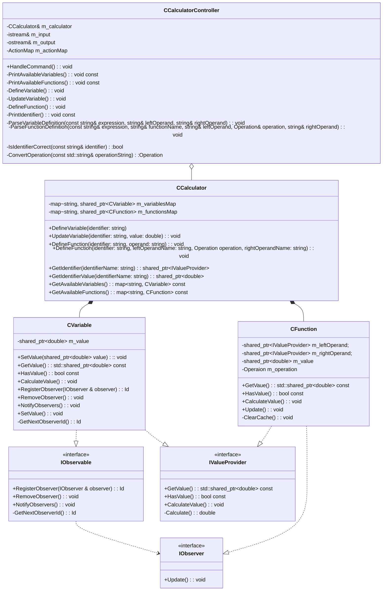

```mermaid
classDiagram
    class CCalculatorController {
        -CCalculator& m_calculator
        -istream& m_input
        -ostream& m_output
        -ActionMap m_actionMap
        +HandleCommand(): void
        -PrintAvailableVariables(): void const
        -PrintAvailableFunctions(): void const
        -DefineVariable(): void
        -UpdateVariable(): void
        -DefineFunction(): void
        -PrintIdentifier(): void const
        -ParseVariableDefinition(const string& expression, string& leftOperand, string& rightOperand): void
        -ParseFunctionDefinition(const string& expression, string& functionName, string& leftOperand, Operation& operation, string& rightOperand): void
        -IsIdentifierCorrect(const string& identifier):bool
        -ConvertOperation(const std::string& operationString):Operation
    }

    class CCalculator {
        -map~string, shared_ptr~CVariable~ m_variablesMap
        -map~string, shared_ptr~CFunction~ m_functionsMap
        +DefineVariable(identifier: string)
        +UpdateVariable(identifier: string, value: double): void
        +DefineFunction(identifier: string, operand: string): void
        +DefineFunction(identifier: string, leftOperandName: string, Operation operation, rightOperandName: string): void
        +GetIdentifier(identifierName: string): shared_ptr~IValueProvider~
        +GetIdentifierValue(identifierName: string): shared_ptr~double~
        +GetAvailableVariables(): map~string, CVariable~ const
        +GetAvailableFunctions(): map~string, CFunction~ const
    }

    class CVariable {
        -shared_ptr~double~ m_value
        +SetValue(shared_ptr~double~ value):: void
        +GetValue(): std::shared_ptr~double~ const
        +HasValue(): bool const
        +CalculateValue(): void
        +RegisterObserver(IObserver & observer): Id
        +RemoveObserver(): void
        +NotifyObservers(): void
        +SetValue(): void
        -GetNextObserverId(): Id
    }

    class CFunction {
        -shared_ptr~IValueProvider~ m_leftOperand;
        -shared_ptr~IValueProvider~ m_rightOperand;
        -shared_ptr~double~ m_value
        -Operaion m_operation
        +GetVaue(): std::shared_ptr~double~ const
        +HasValue(): bool const
        +CalculateValue(): void
        +Update(): void
        -ClearCache(): void
    }

    class IValueProvider {
        <<interface>>
        +GetValue(): std::shared_ptr~double~ const
        +HasValue(): bool const
        +CalculateValue(): void
        -Calculate(): double
    }

    class IObservable {
        <<interface>>
        +RegisterObserver(IObserver & observer): Id
        +RemoveObserver(): void
        +NotifyObservers(): void
        -GetNextObserverId(): Id
    }

    class IObserver {
        <<interface>>
        +Update(): void
    }

    CCalculatorController o-- CCalculator
    CVariable ..|> IObservable
    CCalculator *-- CVariable
    CCalculator *-- CFunction
    CVariable ..|> IValueProvider
    CFunction ..|> IValueProvider
    CFunction ..|> IObserver
    IObservable ..> IObserver

```