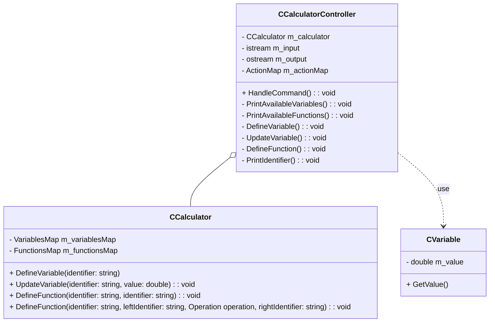

```mermaid
classDiagram

class CCalculatorController {
    - CCalculator m_calculator
    - istream m_input
    - ostream m_output
    - ActionMap m_actionMap
    + HandleCommand(): void
    - PrintAvailableVariables(): void
    - PrintAvailableFunctions(): void
    - DefineVariable(): void
    - UpdateVariable(): void
    - DefineFunction(): void
    - PrintIdentifier(): void
}

class CCalculator {
    - VariablesMap m_variablesMap
    - FunctionsMap m_functionsMap
    + DefineVariable(identifier: string)
    + UpdateVariable(identifier: string, value: double): void
    + DefineFunction(identifier: string, identifier: string): void
    + DefineFunction(identifier: string, leftIdentifier: string, Operation operation, rightIdentifier: string): void
}

class CVariable {
    - double m_value
    + GetValue()
}

CCalculatorController o-- CCalculator
CCalculatorController ..> CVariable : use
```